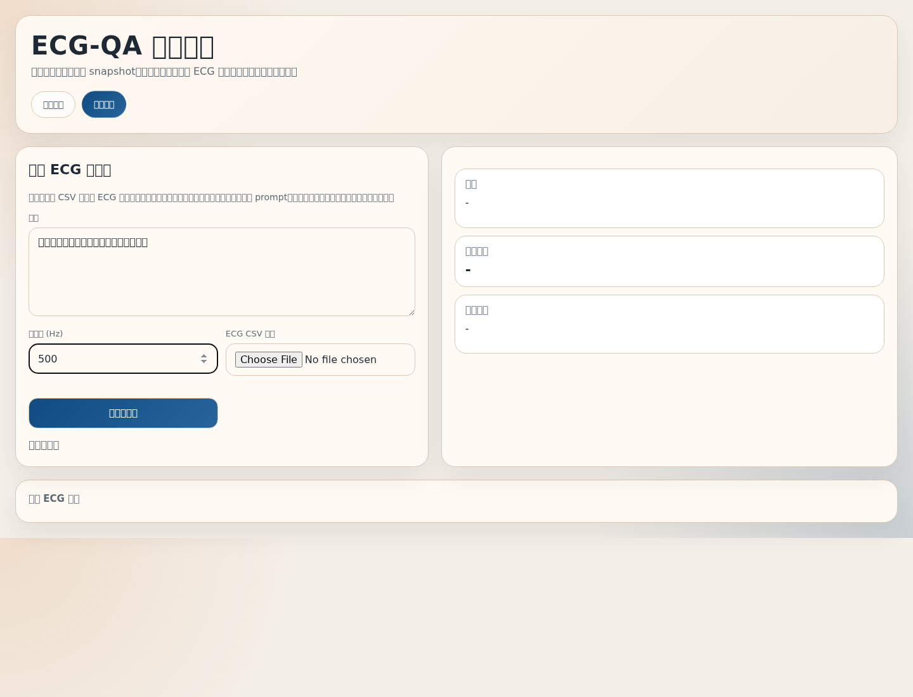
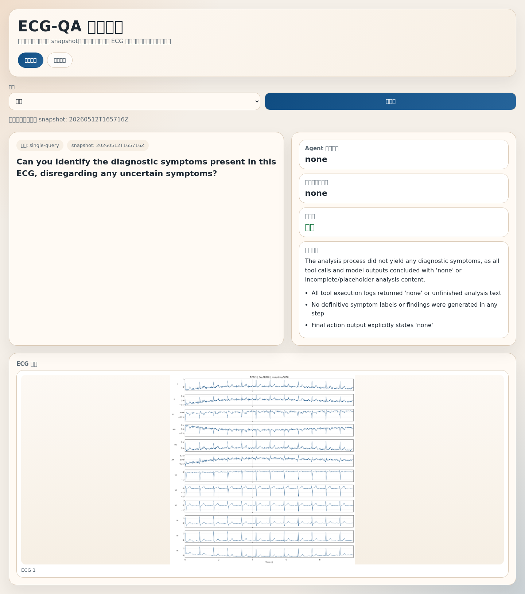

# agentECG

agentECG 用于对 ECG 记录进行问答分析。上传一份 ECG CSV，输入想检查的问题，即可获得分析结论和依据摘要。

## 1. 快速开始

Start the local service:

```bash
uvicorn webapp:app --host 127.0.0.1 --port 8000
```

Submit an ECG file and a question:

```bash
curl -X POST http://127.0.0.1:8000/api/upload/analyze \
  -F "question=请解释这份心电图中最主要的异常表现。" \
  -F "fs=500" \
  -F "ecg_file=@tmp/ecgdeli_example_input.csv"
```

Parameters:

- `question`: question to ask about the ECG.
- `fs`: sampling rate in Hz.
- `ecg_file`: CSV ECG matrix, shaped as `samples x leads`; the first row may contain lead names or signal values.

The included sample file [tmp/ecgdeli_example_input.csv](/home/xl/agentECG/tmp/ecgdeli_example_input.csv) can be used for a first local request.

## 2. Web 页面

Open the app:

```text
http://127.0.0.1:8000/
```

The web interface has two workflows:

- `Analyze ECG`: upload an ECG CSV, enter a question, and review the answer with supporting evidence.
- `Browse snapshots`: inspect published demo results, including ECG images, model answers, reference answers, and evidence summaries.

Analyze ECG:



Browse snapshots:



To publish demo results for browsing:

```bash
python webapp.py publish \
  --result-file tmp/web_results.json \
  --agent-mem-file tmp/web_agent_memories.json
```

To run the included five-query demo and publish it:

```bash
python tmp/run_five_queries_to_snapshot.py
```

Published demo files are stored under:

```text
tmp/web_snapshots/
```

## 3. 安装与配置

Create a Python environment:

```bash
conda create -n ts python=3.10 -y
conda activate ts
```

Install the runtime dependencies used by the web app and analysis pipeline:

```bash
pip install fastapi uvicorn python-multipart wfdb matplotlib numpy torch
pip install smolagents openai PyYAML qdrant-client
```

Training the classifier under `models/pytorch_inception` uses a separate setup. See [models/pytorch_inception/README_ECGQA_TRAINING.md](/home/xl/agentECG/models/pytorch_inception/README_ECGQA_TRAINING.md).

### Configure model credentials

Create a private model config from the template:

```bash
cp utils/model.example.yaml utils/model.yaml
```

Fill in [utils/model.yaml](/home/xl/agentECG/utils/model.yaml). The runtime expects these entries:

- `api.llm.aliyun.qwen-plus`
- `api.llm.aliyun.qwen-vl-plus`
- `api.search-engine.google`

`utils/model.yaml` is ignored by Git and should not be committed.

### Optional: connect Qdrant

The knowledge search tool reads Qdrant settings from environment variables:

```bash
export SEARCH_KB_BACKEND=qdrant
export QDRANT_URL=http://127.0.0.1:6333
export QDRANT_COLLECTION=ecg
export QDRANT_TOP_K=5
export QDRANT_QUERY_MODEL=sentence-transformers/all-MiniLM-L6-v2
export SEARCH_KB_TIMEOUT_SECONDS=2
```

Use `QDRANT_HOST` + `QDRANT_PORT` instead of `QDRANT_URL` if that fits your deployment. Add `QDRANT_API_KEY` for private Qdrant instances.

## 4. Demo Data and Evaluation Data

普通上传分析不需要下载 ECG-QA / PTB-XL 数据。数据集只用于发布 demo snapshots、批量评测和 skill building。

The default evaluation data path is:

```text
dataset/ecgqa_ptbxl/paraphrased/train
```

Download ECG-QA and PTB-XL assets:

```bash
bash load_dataset.sh
```

Notes:

- The repository keeps the `dataset/` structure, not the full dataset contents.
- Dataset files are large and should stay out of Git.
- If the data already exists locally, place it at the expected path and skip the download script.

## 5. Batch Evaluation

Use batch evaluation when you want to run agentECG on ECG-QA style samples instead of one uploaded ECG file.

```python
from data_loader import initialize_dataset
from thread_executor import run_multithreaded_processing
from agent_runner import process_sample

_, dataset_iter = initialize_dataset(
    ptbxl_dir_path="dataset/ecgqa_ptbxl/paraphrased/train",
    question_types=["single-query"],
    sample_limit=20,
    shuffle=True,
    seed=42,
)

run_multithreaded_processing(
    dataset_iter=dataset_iter,
    process_func=process_sample,
    max_workers=2,
    output_file="tmp/eval_results.json",
    save_agent_mem=False,
    agent_mem_file="tmp/eval_agent_mem.json",
    run_mode="eval",
)
```

Run modes:

- `eval`: batch evaluation without writing new skills.
- `skill_build`: reflective runs that can extract reusable skills; use low concurrency, usually `max_workers=1`.

Default skill registry:

```text
agent_reflect/storage/agent_skill_registry.json
```

Long-running job example:

```bash
nohup conda run -n ts python your_run_script.py > run.log 2>&1 &
```

## 6. Troubleshooting

- `ModuleNotFoundError`: install the missing runtime dependency, commonly `torch`, `wfdb`, or an Agent dependency.
- Model credential errors: check [utils/model.yaml](/home/xl/agentECG/utils/model.yaml).
- Empty or malformed upload results: verify the CSV is numeric and shaped as `samples x leads`.
- agentECG is for research, demos, and evaluation workflows; it is not a medical device.
